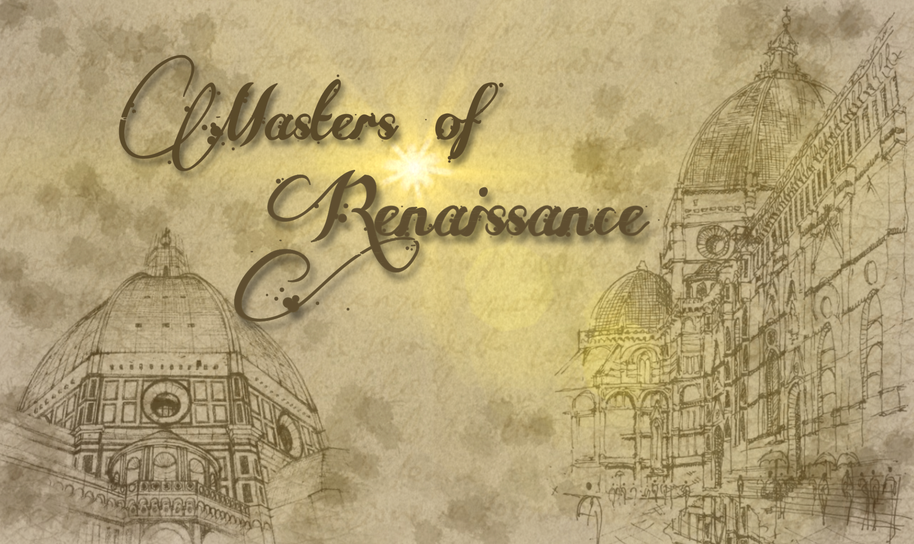

# PROVA FINALE INGEGNERIA DEL SOFTWARE ~ 2020 - 2021

Benvenuti nel gioco da tavolo "Maestri del Rinascimento", in versione digitale!



La versione da noi proposta sfrutta il pattern __Model-View-Controller__ per permettere che un solo server, hostato su macchina, sia in grado di gestire differenti partite in simultanea, ciascuna composta da un massimo di 4 giocatori.
Tutto ciò che riguarda la comunicazione tra i giocatori e il server centrale, connessioni, disconnessioni e riconnessioni è interamente gestito utilizzando Socket TCP come canale comunicativo.

Inoltre, è possibile giocare a "Maestri del Rinascimento" in due differenti modalità: da linea di comando (CLI) oppure attraverso interfaccia grafica (GUI).

Prima di iniziare a giocare, consultare il [regolamento di Masters Of Renaissance](https://github.com/citteriomatteo/ingswAM2021-Barbiero-Citterio-Caspani/tree/main/deliveries/Masters_of_Renaissance_Rules.pdf) per scoprire tutte le caratteristiche del gioco.

## Documentazione

### UML
I diagrammi che seguono rappresentano l'evoluzione schematica del prodotto, da una prima progettazione al diagramma del prodotto finale.
Ai seguenti link sono consultabili entrambe le versioni:
- [UML Iniziali](https://github.com/citteriomatteo/ingswAM2021-Barbiero-Citterio-Caspani/tree/main/deliveries/uml.png)
- [UML Finali]()

### JavaDoc
L'intera documentazione del progetto, tra classi e funzioni, è presente al seguente link : [Javadoc]()

### Librerie e Plugins
|Libreria/Plugin|Descrizione|
|---------------|-----------|
|__Maven__|Strumento di automazione della compilazione utilizzato principalmente per progetti Java.|
|__JavaFx__|Libreria Java usata per la realizzazione dell'interfaccia grafica lato utente.|
|__JUnit 5 Jupiter__|Framework per il test d'unità.|
|__Gson / Gson-extras__|Librerie esterne per il parsing di testo in formato Json.|

## Funzionalità
### Funzionalità Sviluppate
- Regolamento Completo
- Versione CLI
- Versione GUI
- Utilizzo di Socket TCP
- 2 Features aggiuntive:
    - __Resilienza alle Disconnessioni:__ un giocatore è libero di disconnettersi e riconnettersi in seguito in partita, riaccedendo con lo stesso nickname.
      Lo stato del giocatore viene mantenuto anche nel mezzo di un turno semi-completato, dandogli la possibilità, una volta che il turno tornerà suo, di riprendere dal punto esatto in cui era rimasto.
    - __Partite Multiple:__ il server è in grado di gestire più partite in simultanea, e la creazione dei match avviene in serie.
      La procedura di attesa e creazione di una partita viene reiterata per i giocatori che si connetteranno dopo, appena la partita di cui il server si sta occupando di costruire è iniziata.
- Extra Feature:
    - __Rivincita:__ al termine di una partita ne viene presentata la classifica finale e i giocatori possono chiedere la rivincita agli altri presenti.
      Il giocatore più veloce a chiedere la rivincita verrà visualizzato sugli schermi degli altri, i quali potranno accettare o rifiutare la proposta. Se tutti i giocatori accettano, la partita riparte dalla fase iniziale con la stessa configurazione della partita precedente.
      Questa feature è ottima e comoda, soprattutto, se combinata alla funzionalità aggiuntiva di customizzazione dei parametri: la rivincita permetterebbe di saltare la trafila di creazione di una configurazione e passare diretti all'azione.


## Packaging e Jar
I Jar del progetto sono stati creati grazie ad uno specifico plugin offerto da Maven (Shade Plugin).
I Jar precompilati del progetto (due file indipendenti per le figure Client e Server) sono ottenibili scaricandoli dal seguente link: 
- [Masters of Renaissance's Client and Server Jars](https://github.com/citteriomatteo/ingswAM2021-Barbiero-Citterio-Caspani/tree/main/deliveries/jar).

## Esecuzione
Questo progetto richiede Java 11 (o una delle versioni successive) per funzionare in maniera corretta.

### MASTERS OF RENAISSANCE'S CLIENT
Il gioco è disponibile in due versioni: CLI e GUI.

Per godere della massima esperienza di gioco, è necessaria una minima risoluzione schermo di 1024x768 per giocare con grafica avanzata e avviare la versione CLI su un qualsiasi terminale Unix (preferibilmente con Line Wrapping disabilitato).

Di seguito le istruzioni su come lanciare il gioco in entrambe le versioni.

#### CLI
Per poter giocare a Masters of Renaissance in versione CLI, digitare da terminale il comando:
```
java -jar mastersOfRenaissance-client.jar --cli
```
dopo essersi posizionati nella directory in cui risiedono i jar.

#### GUI
La modalità GUI è stata scelta come versione default del gioco.
Di conseguenza, è possibile giocare in modalità GUI in due diversi modi:
- effettuare doppio click sull'eseguibile ```clientApp.jar```
- digitare da terminale il comando:
```
java -jar mastersOfRenaissance-client.jar
```
oppure
```
java -jar mastersOfRenaissance-client.jar --gui
```
dopo essersi posizionati nella directory in cui risiedono i jar.

#### Parametri di lancio del Client
Il Client, una volta eseguito, cercherà di connettersi ad un server in esecuzione su macchina locale (127.0.0.1) alla porta 2500.
Per cambiare i parametri di connessione, aggiungere in fondo al comando da terminale i seguenti settaggi opzionali:
- `--ip` `<ip>`,
  `--address` `<ip>`: per modificare l'indirizzo IP del server;
- `--port` `<port number>` : per specificare una porta preferenziale;

### MASTERS OF RENAISSANCE'S SERVER
Per lanciare Masters of Renaissance Server è necessario aprire il terminale, posizionarsi nella root del file Jar e digitare il comando:
```
java -jar mastersOfRenaissance-server.jar
```
Il server verrà lanciato sulla macchina locale, accettando connessioni sulla porta 2500. 
Per cambiare tale valore, aggiungere in coda al comando un numero, questo verrà utilizzato come nuova porta.

## Membri del team
- [__Federico Caspani__](https://github.com/FedericoCaspani)
- [__Alessandro Barbiero__](https://github.com/AlessandroBarbiero)
- [__Matteo Citterio__](https://github.com/citteriomatteo)